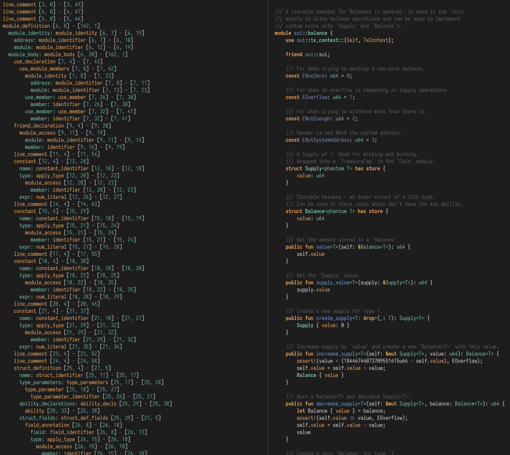

# tree-sitter-move-sui

A [tree-sitter](https://tree-sitter.github.io/) grammar for [Sui
Move](https://docs.sui.io/concepts/sui-move-concepts) (Move 2024 edition),
exported from the [Sui monorepo](https://github.com/MystenLabs/sui)
(`external-crates/move/tooling/tree-sitter`).

The grammar aims for parity with the Move compiler's parser
(`move-compiler/src/parser/syntax.rs`): operator precedence mirrors the
compiler's table, dot/index chains are left-associative, control expressions
follow the compiler's ends-in-block rule, and the contextual `vector` keyword
uses the same token lookahead.

In addition to whole files, the grammar parses the signature fragments that
the move-analyzer LSP renders in hover tooltips (qualified function/struct/enum
signatures, `let x: T` locals, bare types, and so on), so ` ```move ` code
fences in hover markdown highlight correctly without a wrapping module.

## Queries

`queries/` ships highlights, injections (markdown in `///` doc comments),
locals, folds, indents, textobjects, tags, plus `context.scm` and
`rainbow-delimiters.scm` for the corresponding Neovim plugins.

## Neovim setup

With nvim-treesitter (main branch):

```lua
require('nvim-treesitter.parsers').move = {
  install_info = {
    path = "/path/to/tree-sitter-move-sui",
    generate = true,
    queries = "queries/",
  },
}
vim.api.nvim_create_autocmd('FileType', {
  pattern = { 'move' },
  callback = function() vim.treesitter.start() end,
})
```

## External Scanner

The grammar uses an external scanner (`src/scanner.c`) for:

- the contextual `vector` keyword that starts a vector literal (`vector[1, 2]`,
  `vector<u8>[]`, including the spaced forms `vector [1]` / `vector <u8> [1]`).
  Mirroring the Move compiler, `vector` only starts a literal when the next
  token is `[` or `<`; everywhere else it stays an ordinary identifier
  (`vector::empty()`, `use std::vector`).
- block comments, which nest in Move (`/* a /* b */ c */`) and therefore cannot
  be described by a regular-expression token.
- `///` doc comments, whose content is exposed as a `doc_comment` node for
  markdown injection (`////...` is a plain comment again, as in Rust).
- an error sentinel used to detect error-recovery states.

Any build of this parser must therefore compile **both** `src/parser.c` and
`src/scanner.c`. The tree-sitter CLI, `tree-sitter build --wasm`, and the
node-gyp binding pick the scanner up automatically. When building a shared
library by hand:

```sh
cc -shared -fPIC -O2 -I src src/parser.c src/scanner.c -o parser.so
```

## Tests

Requires the tree-sitter CLI (`cargo install tree-sitter-cli`) and python3:

```sh
./run-tests.sh
```

This runs, in order: `tree-sitter generate` (failing on stale conflict
declarations), the tree-shape corpus in `test/corpus/` (`tree-sitter test`),
the highlight assertions in `test/highlights/` (same comment syntax as
tree-sitter's highlight tests, but with nvim's capture-resolution semantics
and no need for a global CLI config), and a parse sweep over `tests/*.move`
(plus the sui-framework and move-stdlib sources when run inside the Sui
monorepo layout).

To parse a single file:

```sh
tree-sitter parse -q -t path/to/file.move
```

Note: there is deliberately no `tree-sitter.json`, which keeps `tree-sitter
generate` on ABI 14 — the Sui monorepo's prettier-move plugin loads this
grammar through `web-tree-sitter` 0.20.x, which cannot load ABI 15 parsers.
Add the file (and regenerate) only after that dependency is upgraded.

## Bindings

- Rust: `cargo test` builds the parser + scanner via `bindings/rust` and runs
  a smoke test.
- Node: `binding.gyp` / `bindings/node` (node-gyp-build).

An example of what the output CST would look like would be the following (NB:
this is using tree sitter to highlight the Move code as well).


